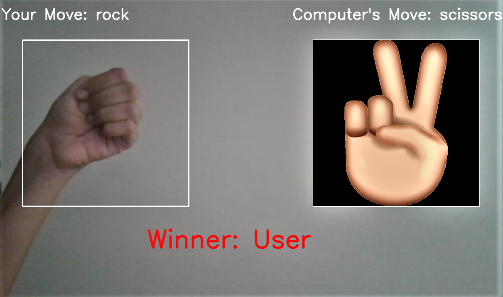

# Rock Paper Scissors
 > Play Rock Paper Scissor against your computer!


## Requirements

- Python 3
- Keras
- Tensorflow
- OpenCV

## How to use

1. Clone this repository:

```sh
$ git clone https://github.com/bhavanaeh/rock-paper-scissors.git
$ cd rock-paper-scissors
```
2. Get the dependencies: 

```python
import cv2
import numpy as np
from keras_squeezenet import SqueezeNet
from keras.optimizers import Adam
from keras.utils import np_utils
from keras.layers import Activation, Dropout, Convolution2D, GlobalAveragePooling2D
from keras.models import Sequential
import tensorflow as tf
import os 
import sys
```
3. Collect images for each gesture i.e. rock, paper and scissors and blank: In this example, I have collected 100 images for the paper gesture. These images collected will be used for training the model.

```sh
$ python3 collect_images.py paper 100
```
4. Train the model:

```sh
$ python3 train.py
```
5. Test the model:

```sh
$ python3 test.py <image_path>
```
6. Play the game against the computer! Press e to exit.
```sh
$ python3 game.py
```

## Output

<p align="center"></p>